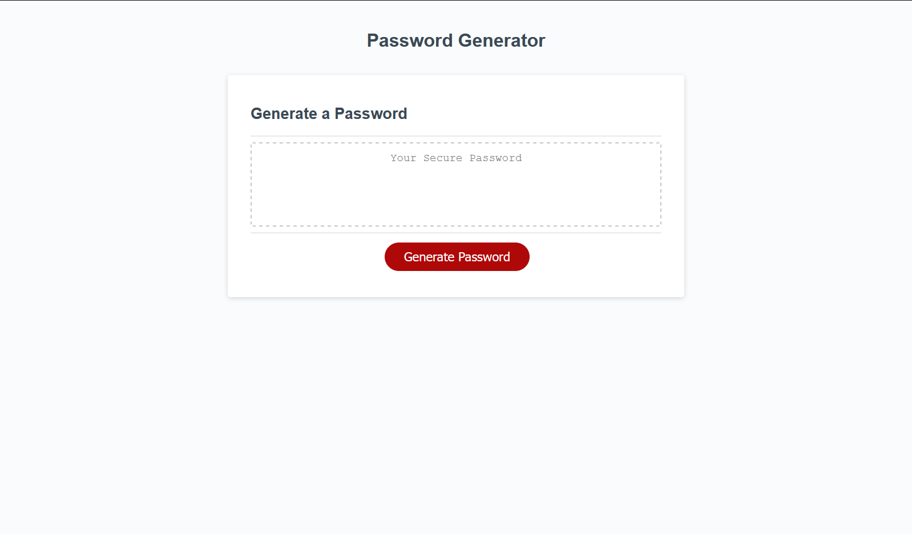
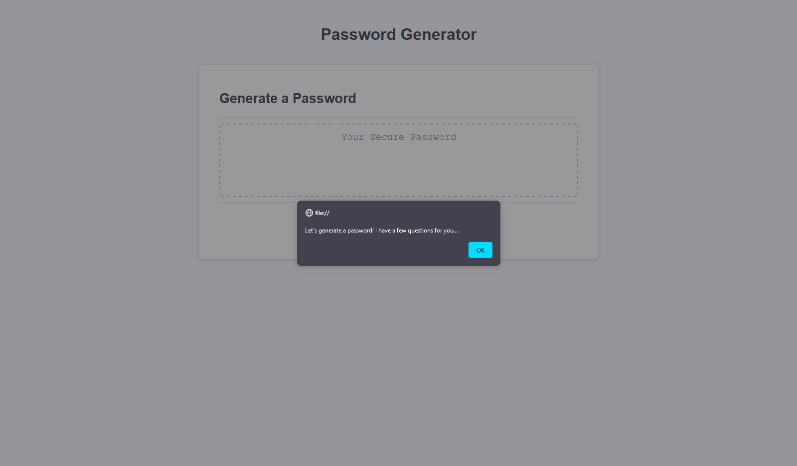
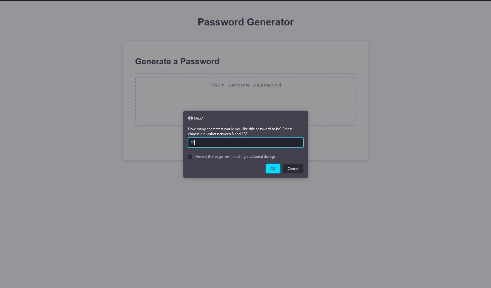
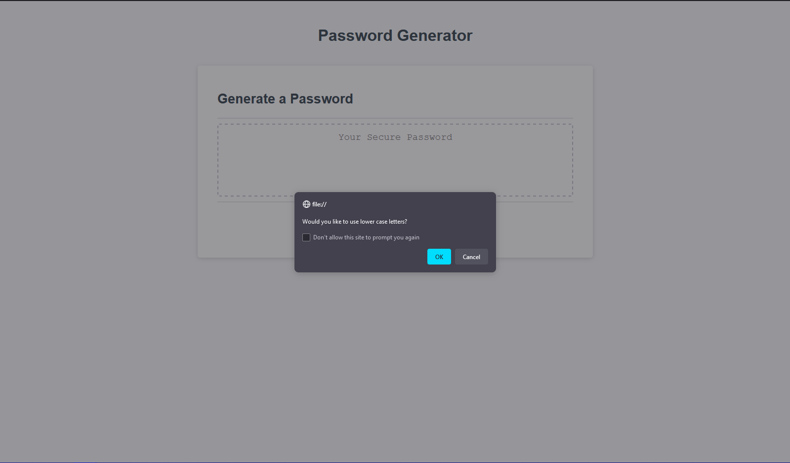
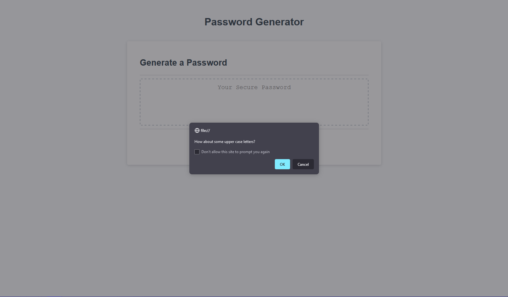
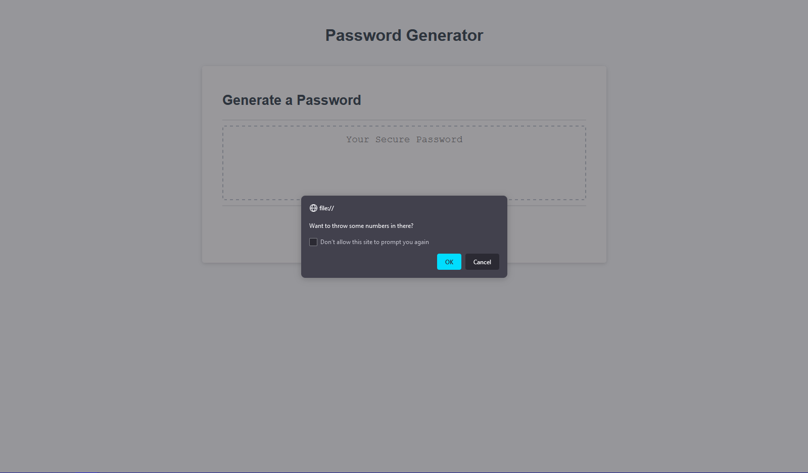
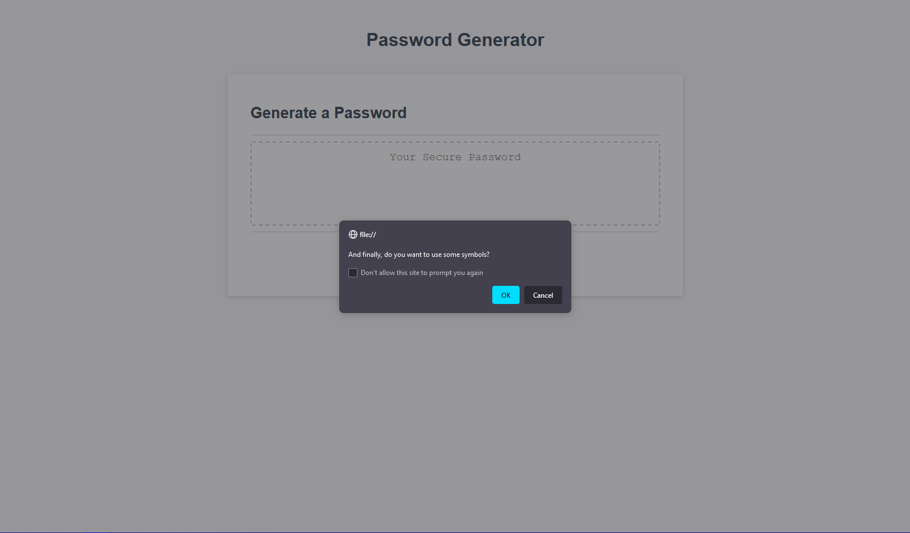
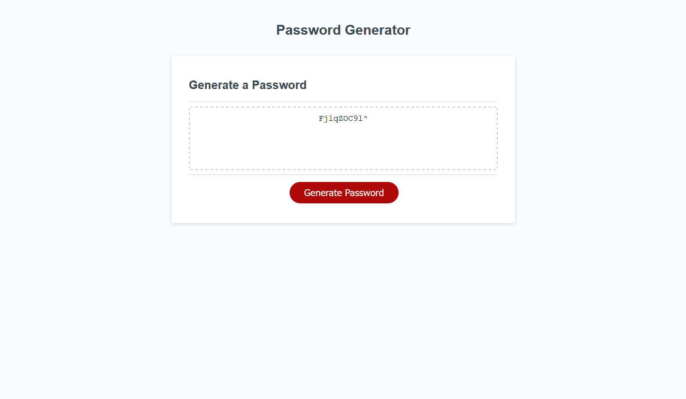

Created the requested password generator in Javascript with the following functions:

  It is able to request how long of a password you would like within a given range of characters.

  It is able to request if you would like your password to be generated using: Upper and lower case letters, numbers, and/or select symbols.
  
  It is able to verify if your choices are valid
  
  If all choices and entries are valid, the script will generate the password within the requested parameters, and display in the supplied box in HTML.
  
  The following are attached images of the program in function.

  ;

  ;

  ;

  ;

  ;

  ;

  ;

  ;